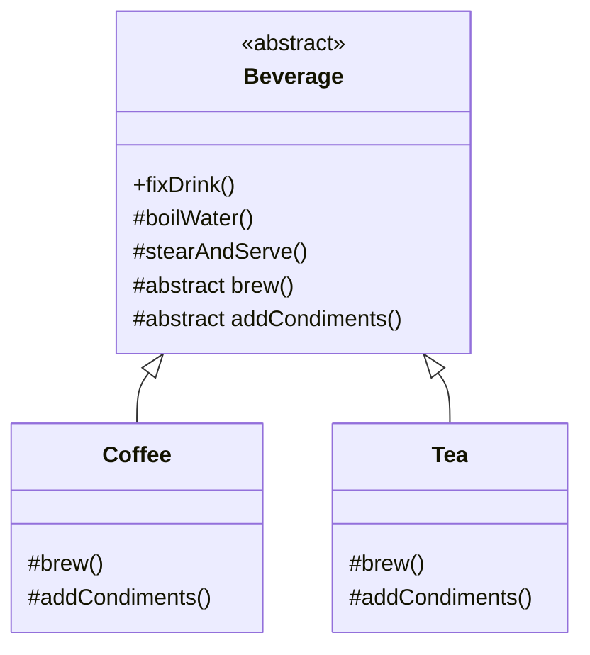
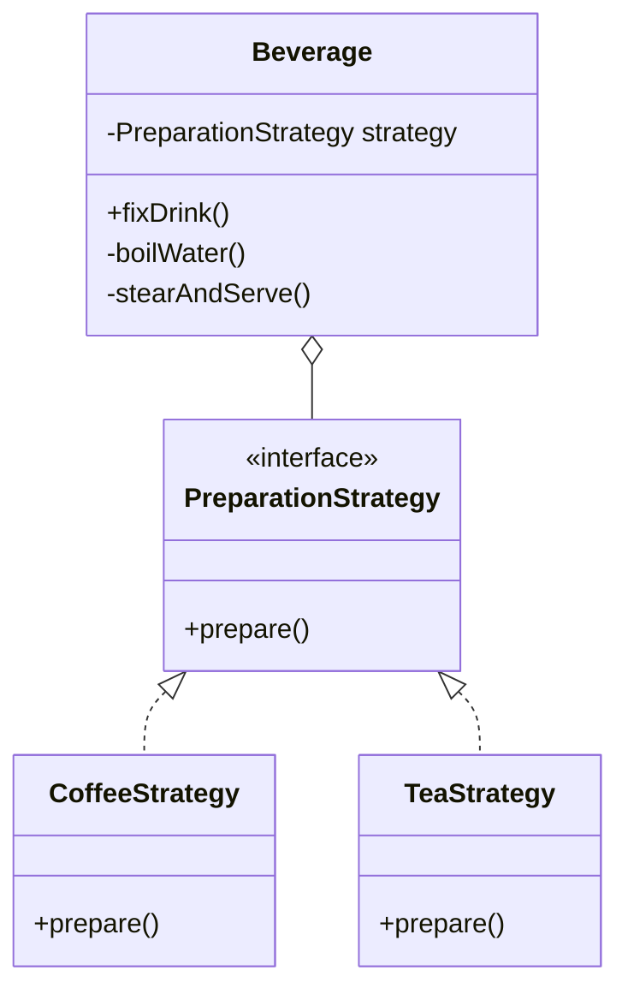

# Problem 2: Beverage Solutions Diagrams

## 1. Template Method

**Diagrama UML:**

```mermaid
classDiagram
    class Beverage {
        <<abstract>>
        +fixDrink()
        #boilWater()
        #stearAndServe()
        #abstract brew()
        #abstract addCondiments()
    }
    class Coffee {
        #brew()
        #addCondiments()
    }
    class Tea {
        #brew()
        #addCondiments()
    }

    Beverage <|-- Coffee
    Beverage <|-- Tea
```

## 2. Strategy Pattern

**Diagrama UML:**

```mermaid
classDiagram
    class Beverage {
        -PreparationStrategy strategy
        +fixDrink()
        -boilWater()
        -stearAndServe()
    }

    class PreparationStrategy {
        <<interface>>
        +prepare()
    }

    class CoffeeStrategy {
        +prepare()
    }

    class TeaStrategy {
        +prepare()
    }

    Beverage o-- PreparationStrategy
    PreparationStrategy <|.. CoffeeStrategy
    PreparationStrategy <|.. TeaStrategy
```
