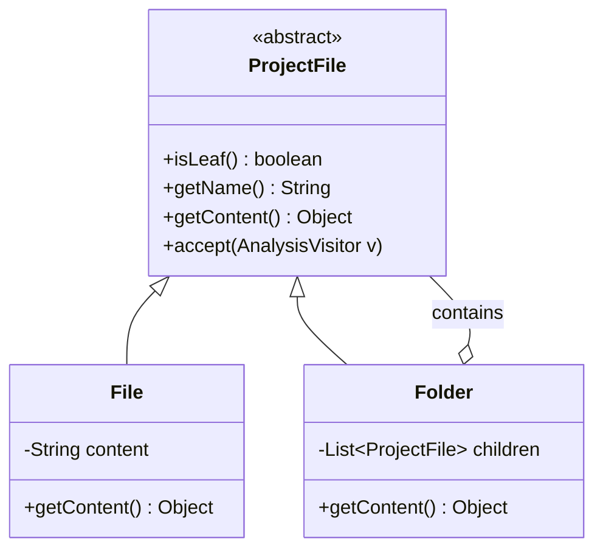
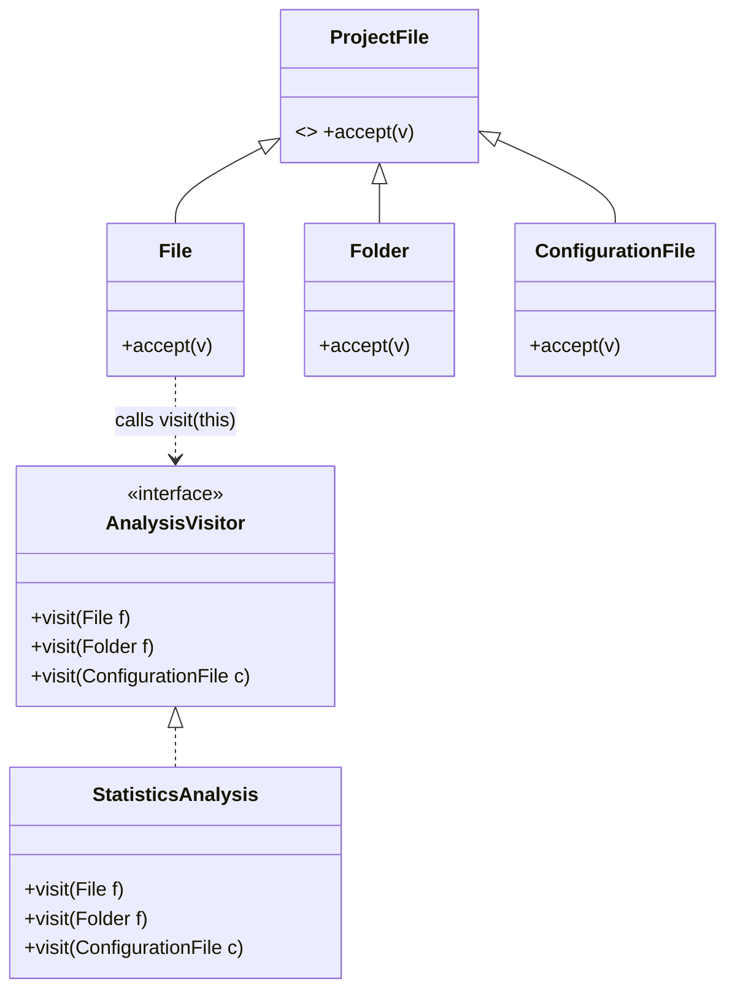

# Problem 3: Static Analysis Solution

### a. Diagrama UML și Design

**Design Pattern:** **Composite**.
**De ce?** Deoarece `ProjectFile` modelează o structură ierarhică (Folder conține Files/Folders), și dorim tratarea unitară a acestora.

**Diagrama de Clase (Composite):**

### b. Extensibilitate (Adăugarea ConfigurationFile)

**Ușurința:** Adăugarea unei noi entități este ușoară în structura de clase (moștenire `ProjectFile`).
**Provocarea:** Dacă folosim Visitor, trebuie modificată interfața `AnalysisVisitor` pentru a include `visit(ConfigurationFile)`, ceea ce sparge Open/Closed Principle pentru vizitatori (toate analizele existente trebuie recompilate/modificate).

**Diagrama (Modificări):**
Adăugarea clasei `ConfigurationFile` și a metodei `visit` corespunzătoare în interfață.

### c. Introducerea Analizelor (Visitor Pattern)

**Design Pattern:** **Visitor**.
**De ce?**
1. Analizele sunt operații externe care se schimbă frecvent (OCP pozitiv pentru adăugare analize).
2. Comportamentul diferă bazat pe tipul concret (`File` vs `Folder`).

**Diagrama (Composite + Visitor):**

### d. Impactul Modificărilor

1. **Adăugare ConfigurationFile + Analize noi:**
   - Adăugăm clasa `ConfigurationFile`.
   - Modificăm `AnalysisVisitor` (adăugăm `visit(ConfigurationFile)`).
   - Updatăm toate implementările existente de `AnalysisVisitor` (ex: `StatisticsAnalysis`).
   - Developerul trebuie să implementeze noile metode în vizitatori.

2. **Adăugare Analiză nouă:**
   - Developerul creează o nouă clasă ce implementează `AnalysisVisitor`.
   - **Nu se modifică codul existent.** (Ideal).

### e. BONUS: Analiza metodei getContent()

**Problema:** Metoda `getContent(): Object` încalcă principiul **Type Safety** și forțează clientul să facă **cast** (downcasting), ceea ce este propice erorilor (Runtime Errors). De asemenea, poate fi considerată o încălcare a **Liskov Substitution Principle** într-un sens larg, deoarece returnează tipuri complet diferite (String vs List) pe care clientul trebuie să le trateze separat, distrugând uniformitatea.

**Soluție:**
1. **Generics:** `ProjectFile<T>` -> `getContent(): T`. Dar `Folder` ar fi `ProjectFile<List<ProjectFile>>` și `File` ar fi `ProjectFile<String>`. Tot greu de tratat uniform într-o listă eterogenă.
2. **Visitor:** Cea mai bună soluție în acest context este **să nu expui `getContent` generic**. Vizitatorul are metode specifice `visit(File f)` unde `f` are `getContent(): String`, și `visit(Folder f)` unde `f` are `getChildren(): List`. Astfel, tipurile sunt cunoscute la compilare în contextul vizitatorului.
3. **Interfețe specifice:** `FileContentProvider` vs `FolderContentProvider`.
