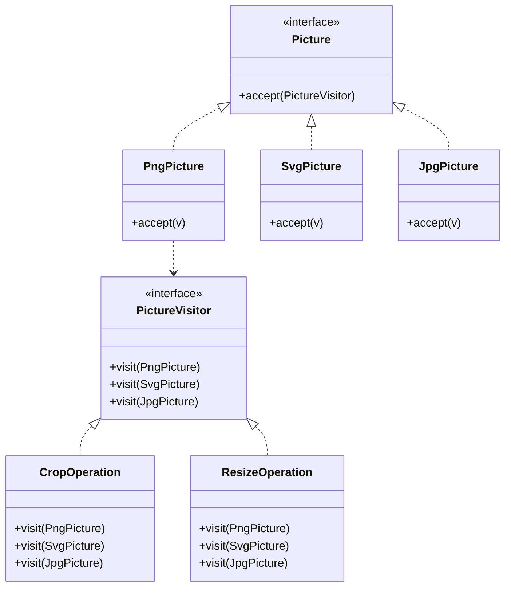

# Problem 2: Cronjobs Solution & Design

## 1. Soluții (Composite vs Decorator)

Cerința este de a executa mai multe joburi (`c1, c2, c3`) într-o ordine specifică, având o singură referință `Cronjob` acceptată de `CronjobExecutor`.

### Soluția 1: Composite Pattern
**Idee:** Creăm un `CompositeCronjob` care conține interne o **listă** de cronjobs. Când i se apelează metoda `perform`, iterează prin listă și le execută pe rând.
**Diagrama:**
Clasa `CompositeCronjob` implementează `Cronjob` și are relație `Has-Many` cu `Cronjob`.

### Soluția 2: Decorator Pattern
**Idee:** Creăm un lanț de obiecte. Fiecare `Decorator` conține o referință către următorul job (sau job-ul curent și cel următor, în funcție de implementare). În exemplul meu, `SequentialCronjobDecorator(current, next)` execută jobul curent, apoi deleagă execuția către `next`.
**Diagrama:**
Clasa `CronjobDecorator` implementează `Cronjob` și are relație `Has-One` cu `Cronjob` (wrapped).

### Diferența Principală
- **Composite:** Este gândit pentru colecții arbitrare ("Un grup de joburi"). Este o structură plată sau arborescentă unde containerul controlează execuția copiilor.
- **Decorator:** Este gândit pentru "înlănțuire" sau adăugare de comportament ("Acest job, ȘI APOI celălalt"). Structura este un Linked List conceptual (fiecare element ține referință la următorul).

Codul sursă pentru ambele soluții și instanțierea lor se află în `src/problem2/Main.java`.

---

# Problem 3: Photo Editor Solution & Design

## a. Design Pattern: Visitor
**De ce?**
Avem o structură stabilă de clase (`Png`, `Svg`, `Jpg`) care nu se schimbă, dar vrem să adăugăm frecvent noi operații (`Crop`, `Resize`, etc.) fără a modifica clasele.
**Visitor** permite definirea operațiilor în clase externe (`CropOperation`, `ResizeOperation`) separând algoritmul de structură.

**Diagrama de Clase:**

## b. Potențiale Probleme (Contexte)
**Avantaj:** Ușor să adaugi operații (Open/Closed compliant pentru operații).
**Problemă:** Dacă trebuie adăugat un **nou format** (ex: GIF), trebuie modificată interfața `PictureVisitor` (adăugat `visit(GifPicture)`). Aceasta încalcă Open/Closed Principle pentru structura vizitatorilor și necesită modificarea TUTUROR operațiilor existente (`Crop`, `Resize`) pentru a implementa noua metodă.

## c. Adăugarea Recolor Implementation
Doar se creează o nouă clasă `RecolorOperation implements PictureVisitor`.
**Nu se modifică nicio clasă existentă.**

## d. BONUS: Adăugarea GIF Support
Dacă investitorii vor GIF:
1. Trebuie creată clasa `GifPicture`.
2. Trebuie modificată interfața `PictureVisitor` cu `visit(GifPicture)`.
3. Trebuie modificate CLASELE `CropOperation`, `ResizeOperation`, `RecolorOperation`, etc. pentru a implementa metoda `visit(GifPicture)`.
**Concluzie:** Design-ul NU este Open-Closed la adăugarea de noi formate. Este "complicat" deoarece impactează toate operațiile existente (ripple effect). Motivul este natura tiparului Visitor (Double Dispatch static).
