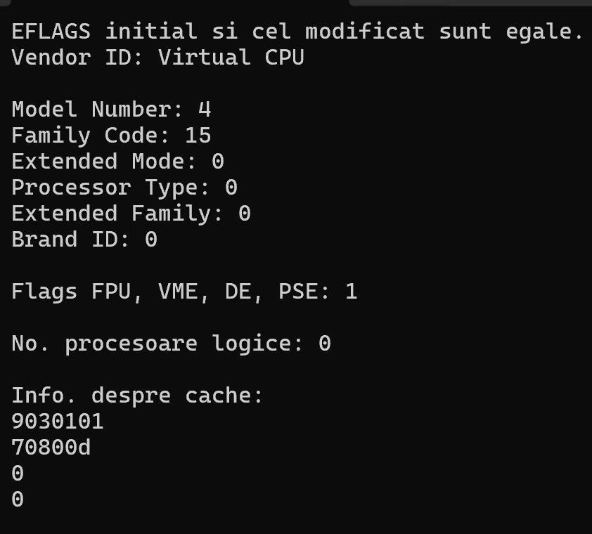

1. Folosind documentația Intel, explicați de ce se aplică următoarele operații pe biți,
constând în deplasarea spre dreapta cu 4, 8, 12, 16, respectiv 20 de poziții, a
variabilelor din porțiunea de cod de mai jos:
```cpp
vendorID[12] = '\0';
cout << "Vendor ID: " << vendorID << "\n\n";
modelNum >>= 4;
FamilyCODE >>= 8;
procTYPE >>= 12;
ExtMODE >>= 16;
extFam >>= 20;
cout << "Model Number: " << modelNum << "\n";
cout << "Family Code: " << FamilyCODE << "\n";
cout << "Extended Mode: " << ExtMODE << "\n";
cout << "Processor Type: " << procTYPE << "\n";
cout << "Extended Family: " << extFam << "\n";
```


2. Explicați care este rolul instrucțiunilor: pushfd si pop eax.

3. Folosind documentația Intel furnizată, scrieți care este registrul procesorului care va
conține informațiile Extended Family și Extended Model în urma apelării instrucțiunii
CPUID și care sunt pozițiile binare revendicate de fiecare dintre acestea.

4. Folosind documentația Intel furnizată, scrieți care este registrul procesorului care va
contine informatiile APIC ID si Count în urma apelării instrucțiunii CPUID și care
sunt pozițiile binare revendicate de fiecare dintre acestea.

5. Folosind documentația Intel furnizată, scrieți care ar trebui să fie continutul binar al
registrului EAX in urma apelului instrucțiunii CPUID pentru procesoarele Intel 486
SX.

6. Folosind documentația Intel furnizată, scrieți care ar trebui să fie continutul binar al
registrului EAX in urma apelului instrucțiunii CPUID pentru procesoarele Intel
Pentium Pro, precum și pentru procesoarele Intel Core i7.

7. Explicați la ce este folosită variabila unsigned long int brandID din codul exemplu.
Care biți, din care registru, vor fi salvați în această variabilă?

